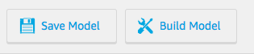
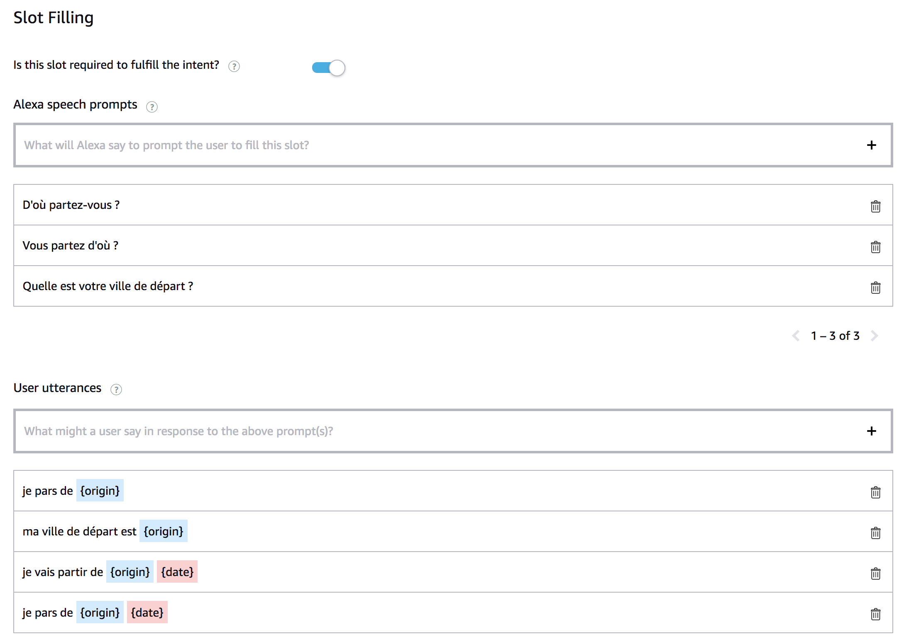

# Skill Creation

You will create your Alexa Skill fully from the [Alexa Developer Console](https://developer.amazon.com/alexa/console/ask).

### **Objective** :  You will create an intention add activate Dialog Management with required slots, prompts & utterances to collect the correct values.

1. Navigate to the [Alexa Developer Console](https://developer.amazon.com/alexa/console/ask) 


2. Create a new Custom Skill with `Alexa-Hosted` for your backend resources. 

>  You can provide any name you want for the `Skill Name` field.


3. On the `Build` Tab of your Skill, delete  the intent `HelloWorldIntent`


4. Save your Interaction Model



>  **Important**: The developer console does not automatically save your work as you make changes. If you close the browser window without clicking Save Model, your work is lost.

5. Update your invocation name to `le genie des dialogues`


6. Save your Interaction Model


7. Add a Custom Intent to your Interaction Model named `TravelIntent`


8. Save your Interaction Model


9. Add the following utterances to the newly created intent `TravelIntent`

```
je veux voyager
                    
je vais à {destination}

je pars de {origin} pour aller à {destination}

je vais à {destination} {date} {time}
```


10. Assign each slot a type

```
(1) destination => AMAZON.City
                    
(2) origin => AMAZON.City

(3) date => AMAZON.DATE

(4) time => AMAZON.TIME
```


>  **Important**: Be aware that you can define the order in which the slot will be collected by Alexa while using the Dialog Management feature.

11. Save your Interaction Model


12. Make `destination` Slot as required

* Click on the `destination` from `TravelIntent` and enable slot required

* Add prompts to allow Alexa to ask the user for this slot value

* Add utterances to allow Alexa to recognize what the user says


>  **Important**: In utterances you provide you shall add the required slot you want to collect {destination}

13. Make `origin` Slot as required

Repeat the same steps as for Slot `destination`



14. Make `date` Slot as required

Repeat the same steps as for Slot `destination`


15. Save your Interaction Model


16. Add an Intent Confirmation 

* Select the intent `TravelIntent` 
* Navigate to `Intent Confirmation` and enable it
* Add the following prompt

```
Vous voyagez bien de {origin} pour aller à {destination} le {date} est-ce correct?
```


17. Save your Interaction Model


18. Build your Interaction Model


> **Important**: You must successfully build the model before you can test it.

### Next : [Create your Skill Backend](./02-backend.md)