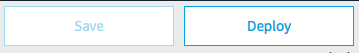

# Skill Backend

### **Objective** : Add the code to handle the requests sent by Alexa using Dialog Management Auto-Delegation.

1. Navigate to `Code` Tab and copy-paste [this backend code](https://gist.githubusercontent.com/nachawat/5594a2d768187657e4f74b9ef5a0525c/raw/68d7559389bda107ea9f84f7e3e5019b6ae377fd/skill-genie-dialog-backend-start.js)

2. Save your code

>  **Important**: The developer console does not automatically save your work as you make changes. If you close the browser window without clicking Save, your work is lost.

3. Deploy your code

> **Important**: You must successfully deploy the code before you can test it.

### Next : [Test your Skill](./03-test.md)