# Combine Delegation and Manual Control for Dialogs

### **Objective** : You will create an intention add activate Dialog Management with required slots, prompts & utterances to collect the correct values.

1. Navigate to the `Build` Tab

2. Create a Custom Slot Type named `Drink_Type`

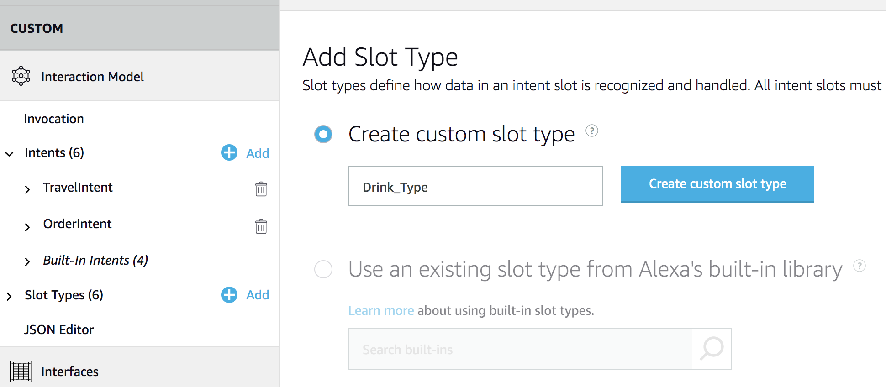

Then add the following values (don't forget the ID column!)

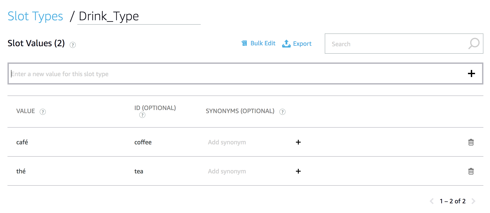

3. Create a Custom Slot Type named `Coffee_Roast_Type`

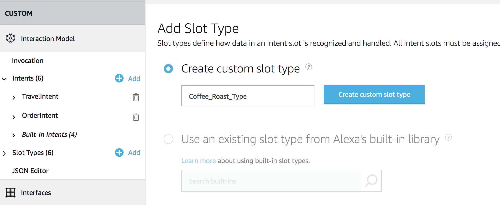

Then add the following values (don't forget the synonyms column!)

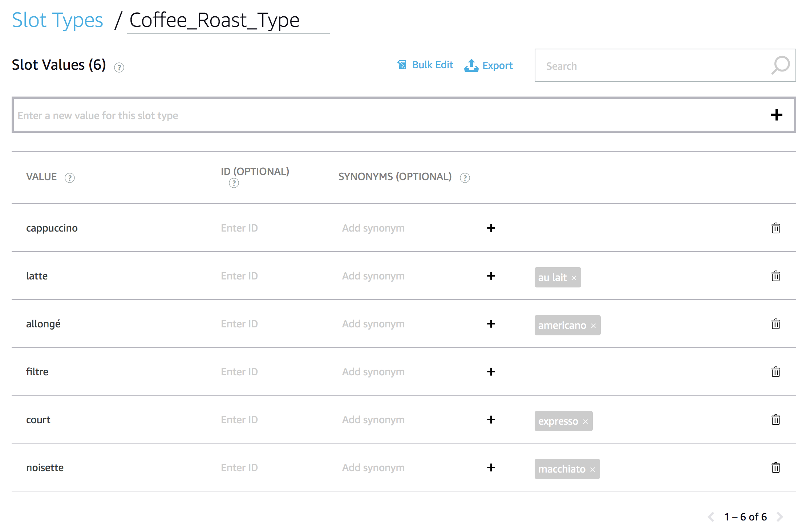

4. Create a Custom Slot Type named `Tea_Type`

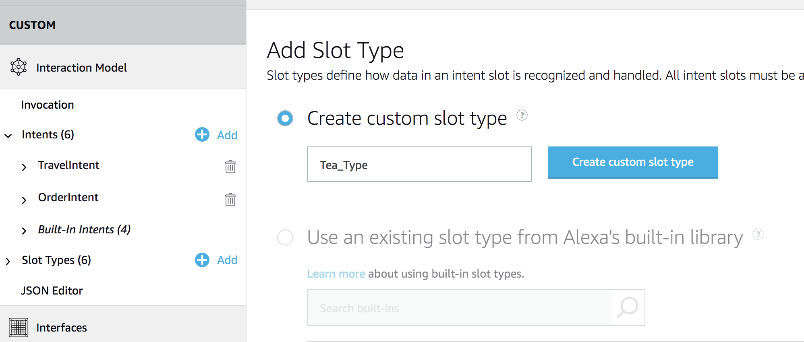

Then add the following values

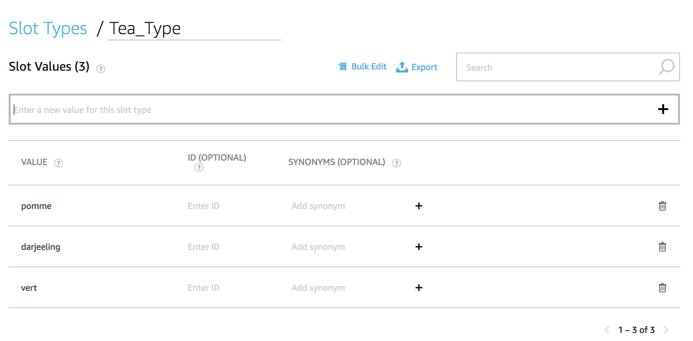

5. Save your Interaction Model

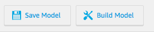

6. Add a Custom Intent to your Interaction Model named `OrderIntent`

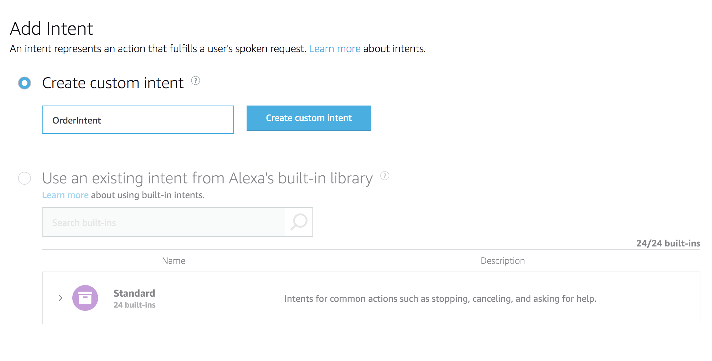

7. Save your Interaction Model


8. Add the following utterances to the newly created intent `OrderIntent`

```
j'ai soif
                    
je veux boire un {drink} {coffeeRoast}

je veux un {drink}

un {drink} {teaType}
```

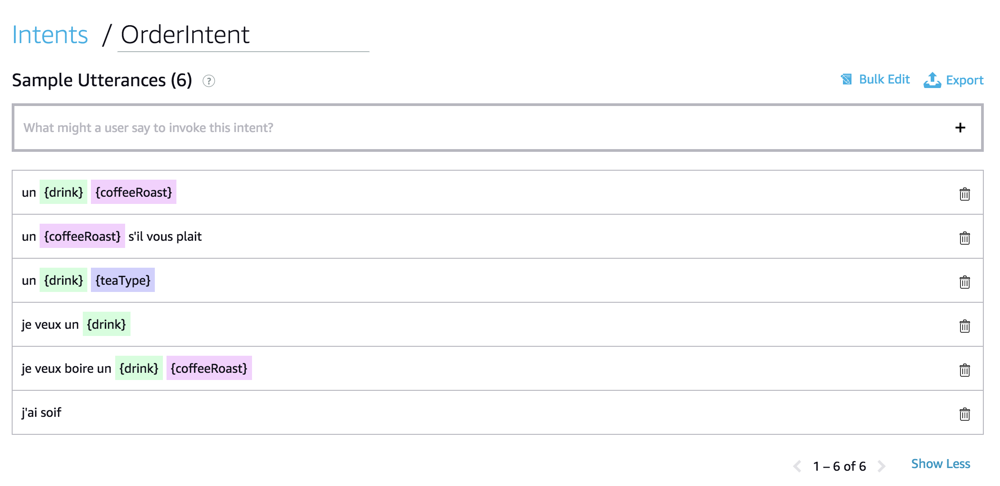

9. Disable Dialog Auto Delegation

To allow Alexa to sent request for each turn of a dialog, as the default Skill strategy is Auto-delegation (default), we shall disable the `Auto-Delegation` Strategy.

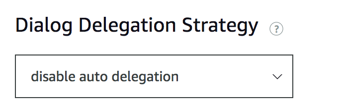

10. Assign each slot a type

```
(1) drink => Drink_Type
                    
(2) coffeeRoast => Coffee_Roast_Type

(3) teaType => Tea_Type

```

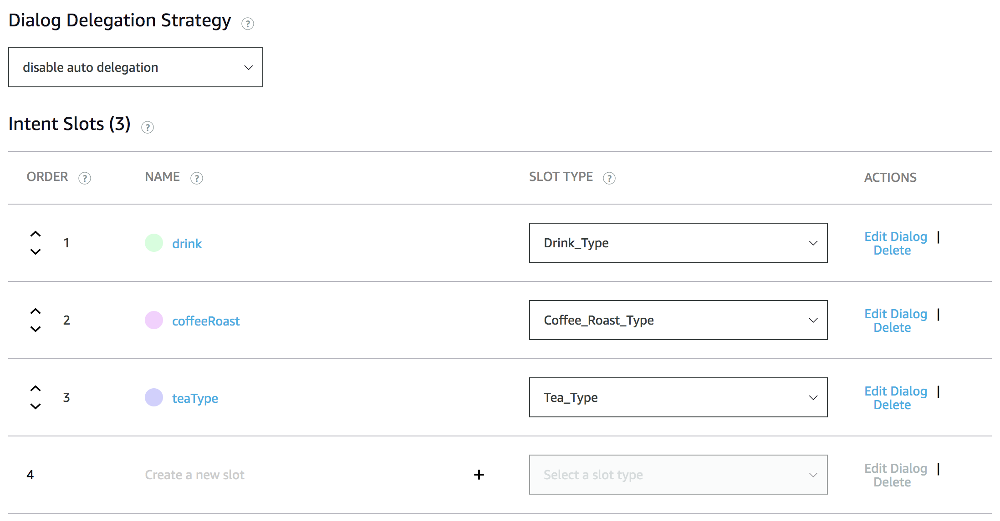

>  **Important**: Be aware that you can define the order in which the slot will be collected by Alexa while using the Dialog Management feature.

11. Save your Interaction Model


12. Make `drink` Slot as required

* Click on the `drink` slot from `OrderIntent` and enable slot required

* Add prompts to allow Alexa to ask the user for this slot value

* Add utterances to allow Alexa to recognize what the user says

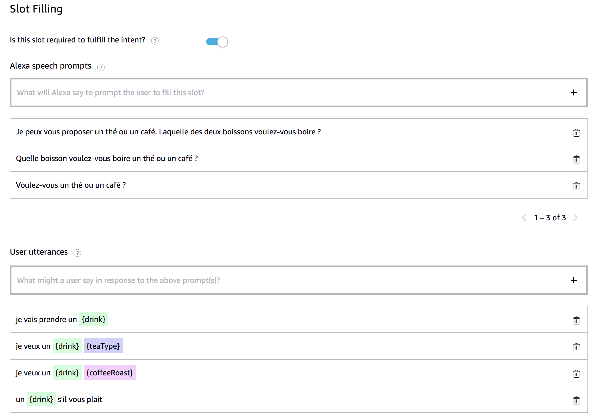

>  **Important**: In utterances you provide you shall add the required slot you want to collect {destination}

13. Add Validation Rules for `drink` slot

Slot validation lets you create validation rules for your slot values. Alexa can then check the user's response against these rules and prompt the user if the user provides an unacceptable value.

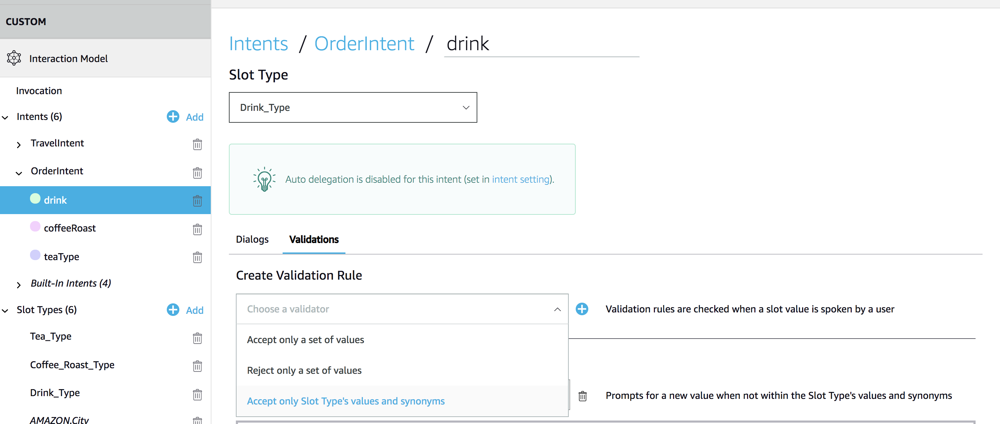

We will limit the eligible `drink` values to the values listed in the `Drink_Type` SlotType using a `Accept only Slot type's values and synonyms` validation rule.

Accept values that are defined in the list of custom slot type values and synonyms. If the user provides a value that does not match any of these defined values, the value fails the validation and Alexa can use your prompts to ask the user for a new value.
In this way, it will allow us to limit the eligibel 

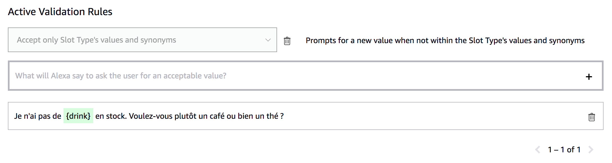

14. Save your Interaction Model


15. Build your Interaction Model


> **Important**: You must successfully build the model before you can test it.

### Next : [Update your Skill Backend](./05-backend-orderintent.md)