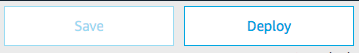

# Handle Dialog for orderintent in your backend

### **Objective** : You will update the code to take into account requests sent by the Alexa Service to handle Dialog for orderintent dialog. It will combine delegation and manual control (elicitslot). To start the dialog, delegation will be used to find the drink. Once the drink has been found (coffee or tea), we will elicit the type of coffee or tea from our backend.  

1. Navigate to `Code` Tab 

2. Create a new Handler name `StartedInProgressOrderIntentHandler`

This handler will be called to start the dialog when the user will say something like `j'ai soif` (aka without any slot).

```javascript
const StartedInProgressOrderIntentHandler = {
    canHandle(handlerInput) {
      // TODO 
    },
    handle(handlerInput) {
      // TOO
    },
};
```

The `canHandle` function returns true if:

* `request.type` equals `IntentRequest`
* `request.intent.name` equals `OrderIntent`
* `request.dialogState` is not `COMPLETED`

```javascript
    canHandle(handlerInput) {
        const request = handlerInput.requestEnvelope.request;
        return request.type === 'IntentRequest' &&
            request.intent.name === 'OrderIntent' &&
            request.dialogState !== 'COMPLETED';
    },
```

The handle function simply returns Dialog.Delegate so Alexa will automatically prompt for the missing required slot.

```javascript
    handle(handlerInput) {
        return handlerInput.responseBuilder
            .addDelegateDirective()
            .getResponse();
    },
```

3. Create a new Handler name `CoffeeGivenOrderIntentHandler`

This handler will use `Dialog.ElicitSlot` in order to elicit the `coffeRoast` slot since our drink slot is coffee.

```javascript
const CoffeeGivenOrderIntentHandler = {
    canHandle(handlerInput) {
      // TODO 
    },
    handle(handlerInput) {
      // TOO
    },
};
```
The `canHandle` function returns true if:

* `request.type` equals `IntentRequest`
* `request.intent.name` equals `OrderIntent`
* `request.intent.slots.drink.value` (represented in the code by .spoken) is not empty
* `request.intent.slots.drink.id` (from entity resolution) equals `coffee`
* `request.intent.slots.coffeeRoast.value` (represented in the code by .spoken) is empty

```javascript
    canHandle(handlerInput) {
        if (handlerInput.requestEnvelope.request.type === "IntentRequest"
            && handlerInput.requestEnvelope.request.intent.name === "OrderIntent") {
            const slotValues = getSlotValues(handlerInput.requestEnvelope.request.intent.slots);
            return slotValues.drink.spoken
                && slotValues.drink.id === 'coffee'
                && !slotValues.coffeeRoast.spoken
        }
        return false;
    },
```

The handle function will define the speak and reprompts just as if it were returning a standard speech directive, however calling addElicitSlotDirective will cause Alexa to elicit the given slot next even if it wasn't marked required in our Voice Model.

```javascript
    handle(handlerInput) {
        return handlerInput.responseBuilder
            .speak('Je peux vous proposer un café court, allongé ou noisette. Lequel préférez-vous ?')
            .reprompt('Voulez-vous un café court, allongé ou noisette ?')
            .addElicitSlotDirective('coffeeRoast')
            .getResponse();
    }
```

4. Create a new Handler name `TeaGivenOrderIntentHandler`

This handler will use `Dialog.ElicitSlot` in order to elicit the `teaType` slot since our drink slot is tea.

```javascript
const TeaGivenOrderIntentHandler = {
    canHandle(handlerInput) {
      // TODO 
    },
    handle(handlerInput) {
      // TOO
    },
};
```
The `canHandle` function returns true if:

* `request.type` equals `IntentRequest`
* `request.intent.name` equals `OrderIntent`
* `request.intent.slots.drink.value` (represented in the code by .spoken) is not empty
* `request.intent.slots.drink.id` (from entity resolution) equals `tea`
* `request.intent.slots.teaType.value` (represented in the code by .spoken) is empty

```javascript
    canHandle(handlerInput) {
        if (handlerInput.requestEnvelope.request.type === "IntentRequest"
            && handlerInput.requestEnvelope.request.intent.name === "OrderIntent") {
            const slotValues = getSlotValues(handlerInput.requestEnvelope.request.intent.slots);
            return slotValues.drink.spoken
                && slotValues.drink.id === 'tea'
                && !slotValues.teaType.spoken
        }
        return false;
    },
```

The handle function will define the speak and reprompts just as if it were returning a standard speech directive, however calling addElicitSlotDirective will cause Alexa to elicit the given slot next even if it wasn't marked required in our Voice Model.

```javascript
    handle(handlerInput) {
        return handlerInput.responseBuilder
            .speak("Quel type de thé voulez-vous : darjeeling, vert ou à la pomme ?")
            .reprompt("Vous préférez du thé vert, darjeeling ou la pomme ?")
            .addElicitSlotDirective('teaType')
            .getResponse();
    }
```

5. Create a new Handler name `CompletedOrderIntentHandler`

Once we've collected all the necessary slots, we will need to place the customer's drink order. For our sample, we'll simply have Alexa repeat their order back. To do that we need to make a handler that runs when dialog management has completed collecting the slots.

```javascript
const CompletedOrderIntentHandler = {
    canHandle(handlerInput) {
      // TODO 
    },
    handle(handlerInput) {
      // TOO
    },
};
```
The `canHandle` function returns true if:

* `request.type` equals `IntentRequest`
* `request.intent.name` equals `OrderIntent`
* `request.dialogState` is `COMPLETED`

```javascript
    canHandle(handlerInput) {
        return handlerInput.requestEnvelope.request.type === "IntentRequest"
            && handlerInput.requestEnvelope.request.intent.name === "OrderIntent"
            && handlerInput.requestEnvelope.request.dialogState === "COMPLETED";
    },
```

The handle function will access our slots and build up the response based upon the customer's drink selection.

```javascript
    handle(handlerInput) {
        const slotValues = getSlotValues(handlerInput.requestEnvelope.request.intent.slots);
        const drink = slotValues.drink.spoken;
        let type;

        if (slotValues.drink.id === 'coffee') {
            type = slotValues.coffeeRoast.resolved;
        } else if (slotValues.drink.id === 'tea') {
            type = slotValues.teaType.resolved;
        }

        const speechText = `Je prépare votre commande : un ${drink} ${type} !`;
        return handlerInput.responseBuilder
            .speak(speechText)
            .getResponse();
    }
```

6. Attach the `Handlers` to your SkillBuilder instance

```javascript
.addRequestHandlers(
        LaunchRequestHandler,
        CompletedTravelIntentHandler,
        CoffeeGivenOrderIntentHandler,
        TeaGivenOrderIntentHandler,
        StartedInProgressOrderIntentHandler,
        CompletedOrderIntentHandler,       
        HelpIntentHandler,
        CancelAndStopIntentHandler,
        SessionEndedRequestHandler
    )
```

> **Important**: Be aware that the handlers are ordered ! The first Handler `.canHandle()` method which return `true` will result in this Handler being called (aka the `.handle()` method of the same handler will be called and only this one, not the other handlers.)

7. Locate `dialogIntents` constant and uncommented `OrderIntent`.

This will allow the Skill to either propose a dialog purely based on `Auto-Delegation` through `TravelIntent` or a dialog combining delegation and manual elicitation with `OrderIntent`.

8. Deploy your code



> **Important**: You must successfully deploy the code before you can test it.

### Next : [Test](./06-test-orderintent.md)